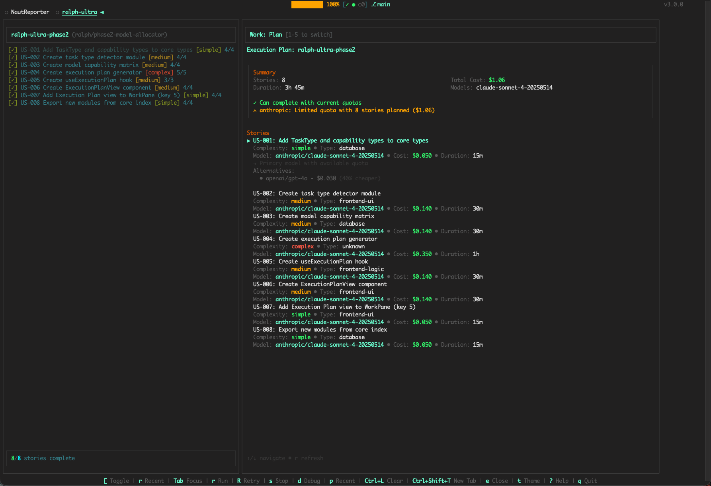

# Ralph Ultra 3.0

> **Smart AI Agent Orchestrator** — TUI with Intelligent Model Selection, Quota Management & Cost Tracking

[](https://github.com/48Nauts-Operator/ralph-ultra/releases)
[](LICENSE)
[](https://www.typescriptlang.org/)
[](https://bun.sh/)

> **BETA VERSION** — Features are functional but may contain bugs. Feedback welcome!



Ralph Ultra 3.0 is a **terminal UI for orchestrating autonomous coding agents** with intelligent model selection. It analyzes your PRD, recommends the optimal model for each task, tracks API quotas across providers, and estimates costs before execution.

---

## What's New in 3.0

### Smart Model Allocator

- **Task Detection** — Analyzes each story to detect task type (frontend-ui, backend-api, testing, etc.)
- **Capability Matching** — Maps task requirements to model strengths
- **Cost Optimization** — Recommends cheapest capable model for each task
- **Execution Plan** — View the full plan with cost estimates before running

### Multi-Provider Quota Dashboard

- **Anthropic** — Daily/weekly usage tracking from Claude session data
- **OpenAI** — Subscription status and model availability
- **OpenRouter** — Real-time credit balance
- **Gemini** — Rate limit monitoring
- **Local (LM Studio)** — Auto-discovers loaded models

### Enhanced Views

- **Plan View (key 5)** — Execution plan with model assignments and cost projections
- **Quota View (key 4)** — Provider quotas with progress bars and model lists
- **Version View (key 7)** — System info, CLI tools, and changelog browser

---

## Key Features

### Beautiful Terminal UI

- **Three-Pane Layout** — Projects rail, sessions/tasks pane, and dynamic work pane
- **Multi-Tab Support** — Monitor multiple projects simultaneously
- **Theme System** — Nano Dark and Nano Light themes
- **Responsive Design** — Adapts to any terminal size

### PRD-Based Workflows

- **Testable Acceptance Criteria** — Every AC has a shell command that verifies completion
- **Auto-Verification** — Ralph runs tests after each story, retries on failure
- **Progress Tracking** — Real-time status updates as stories complete

### Remote Control via Tailscale

- **Secure Access** — Monitor from anywhere via encrypted connection
- **Web-Based Client** — View and control from any browser
- **Token Authentication** — Secure tokens for each session

### Session Persistence

- **Auto-Save** — State saved every 30 seconds
- **Crash Recovery** — Resume exactly where you left off
- **Multi-Project** — Independent sessions per project

---

## Quick Start

### Prerequisites

- **Bun** — Runtime and package manager ([install](https://bun.sh))
- **Claude CLI** or **Aider** — For AI code generation
- **Tailscale** — For remote access (optional)

### Installation

```bash
# Clone the repository
git clone https://github.com/48Nauts-Operator/ralph-ultra.git
cd ralph-ultra

# Install dependencies
bun install

# Run in development mode
bun run dev

# Or build and run production bundle
bun run build
./dist/ralph-ultra
```

---

## Creating a PRD

Ralph uses PRD files (`prd.json`) with **testable acceptance criteria**.

### Example PRD

```json
{
  "project": "my-feature",
  "description": "Add user authentication",
  "userStories": [
    {
      "id": "US-001",
      "title": "Login Page",
      "description": "Create login page with email/password",
      "acceptanceCriteria": [
        {
          "id": "AC-001-1",
          "text": "Login component exists",
          "testCommand": "test -f src/components/Login.tsx",
          "passes": false,
          "lastRun": null
        },
        {
          "id": "AC-001-2",
          "text": "Form has email and password fields",
          "testCommand": "grep -q 'type=\"email\"' src/components/Login.tsx && grep -q 'type=\"password\"' src/components/Login.tsx",
          "passes": false,
          "lastRun": null
        }
      ],
      "complexity": "medium",
      "passes": false
    }
  ]
}
```

### testCommand Patterns

| Check             | Command                                |
| ----------------- | -------------------------------------- |
| File exists       | `test -f src/file.ts`                  |
| Directory exists  | `test -d src/components`               |
| Pattern in file   | `grep -q 'pattern' src/file.ts`        |
| Multiple patterns | `grep -q 'a' f.ts && grep -q 'b' f.ts` |
| Build passes      | `bun run build`                        |
| Tests pass        | `bun test`                             |
| Type check        | `bun run typecheck`                    |

---

## Keyboard Shortcuts

### Navigation

| Key               | Action                    |
| ----------------- | ------------------------- |
| `Tab`             | Cycle focus between panes |
| `j/k` or `arrows` | Navigate within pane      |
| `Enter`           | Activate selected item    |
| `Esc`             | Close overlay/modal       |

### Views

| Key | View                       |
| --- | -------------------------- |
| `1` | Monitor (logs)             |
| `2` | Status (system info)       |
| `3` | Details (story info)       |
| `4` | Quota (provider quotas)    |
| `5` | Plan (execution plan)      |
| `6` | Help (commands)            |
| `7` | Version (system/changelog) |

### Actions

| Key             | Action                         |
| --------------- | ------------------------------ |
| `r`             | Run Ralph on current project   |
| `s`             | Stop running process           |
| `R`             | Refresh quotas (in Quota view) |
| `t`             | Open theme settings            |
| `?`             | Show help overlay              |
| `q`             | Quit application               |
| `:` or `Ctrl+P` | Open command palette           |

### Tabs

| Key             | Action               |
| --------------- | -------------------- |
| `Ctrl+Shift+T`  | Open new tab         |
| `Ctrl+Shift+W`  | Close current tab    |
| `Ctrl+Tab`      | Cycle through tabs   |
| `Ctrl+1/2/3...` | Jump to specific tab |

---

## Architecture

```
ralph-ultra/
├── src/
│   ├── components/       # React Ink components
│   │   ├── App.tsx       # Main application
│   │   ├── WorkPane.tsx  # Right work area (views)
│   │   ├── QuotaDashboard.tsx    # Provider quota display
│   │   ├── ExecutionPlanView.tsx # Plan visualization
│   │   └── VersionView.tsx       # System info
│   ├── core/             # Business logic
│   │   ├── quota-manager.ts      # Multi-provider quota checking
│   │   ├── task-detector.ts      # Story task type detection
│   │   ├── capability-matrix.ts  # Model-to-task mapping
│   │   ├── execution-planner.ts  # Plan generation
│   │   ├── state-store.ts        # Global state management
│   │   └── event-bus.ts          # Event pub/sub
│   ├── hooks/            # React hooks
│   │   ├── useQuotas.tsx         # Quota subscription
│   │   ├── useExecutionPlan.tsx  # Plan generation hook
│   │   └── useTabs.tsx           # Multi-tab management
│   ├── themes/           # Theme definitions
│   └── utils/            # Utility modules
```

---

## Supported Providers

| Provider       | Quota Type         | Detection                    |
| -------------- | ------------------ | ---------------------------- |
| **Anthropic**  | Daily/Weekly usage | Claude session file analysis |
| **OpenAI**     | Subscription       | API key validation           |
| **OpenRouter** | Credits            | `/api/v1/credits` endpoint   |
| **Gemini**     | Rate limit         | API key validation           |
| **Local**      | Unlimited          | LM Studio `/v1/models` API   |

---

## Development

```bash
# Development mode with hot reload
bun run dev

# Type checking
bun run typecheck

# Linting
bun run lint

# Production build
bun run build
```

---

## Roadmap

- [x] Phase 1: Quota Manager architecture
- [x] Phase 2: Smart Model Allocator
- [ ] Phase 3: Execute with Plan + Cost Tracking
- [ ] Phase 4: Learning System (performance history)
- [ ] Phase 5: Web Dashboard

---

## License

MIT License — see [LICENSE](LICENSE) for details.

---

**Built by 48Nauts** — Part of the Ralph ecosystem

- [Ralph Ultra](https://github.com/48Nauts-Operator/ralph-ultra) — This project
- [Ralph Nano](https://github.com/48Nauts-Operator/ralph-nano) — Lightweight execution engine

<p align="center">
  <strong>Ralph Ultra 3.0</strong> — Smart AI Agent Orchestrator<br>
  <a href="https://github.com/48Nauts-Operator/ralph-ultra/releases">Download Latest Release</a>
</p>
